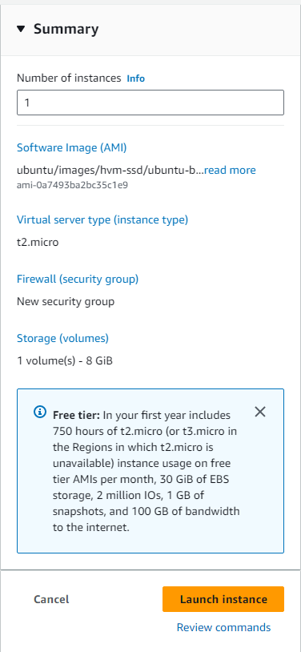

## What is DevOps?
DevOps is a methodology that is introduced to bridge the gap between developers and operations. This is to improve the software development life cycle. It promotes the automation of processes that allows the team to build, test and release software efficiently and effectively.

### *Note*
*Make sure not to share or publish the aws credential or access keys, if discover that you intentially or unintentially leak those information, the company and you will get fined.*

For training, the region is in Ireland: eu-west-1 

## The difference between AWS and Azure

|  | Azure | AWS |
| ---------| ---------| -------|   
| Resource Groups | Necessary, everything goes into a resource group | Not necessary |
| Public IP address | Static | Dynamic |
| Terminology | create vm | launch instances |

### How to create ssh key on aws
1) Search: key pairs 
2) Create key pair
3) Select .pem file for use with OpenSSH
  
### Launch EC2 Intances or Create Virtual Machines
1) Give it a name: tech241-parichat-app-vm
2) Select image: browse more > community hub > ***ubuntun 18.04 lts 1e9***
3) Instance types: t2.micro (for training)
4) key pair: tech241 (shared key pair)
5) Network as default
6) Create security group and modify so that we can reuse it for every vm
   1) edit
   2) change name so you can remember and reuse it
   3) add port 3000 inbound rule
7) Configure storage as default

### Display of launching instance summary

### Terminate EC2 Instances
1) locate *instance state*
2) select *teminate instance*