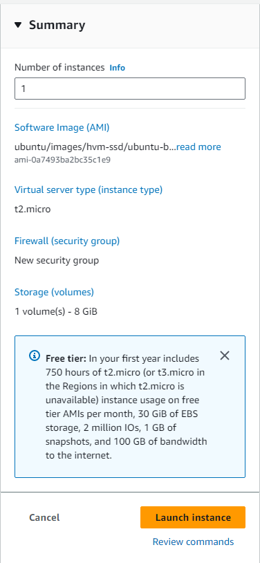
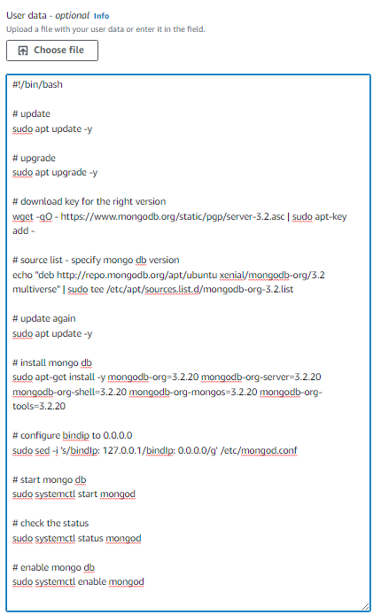
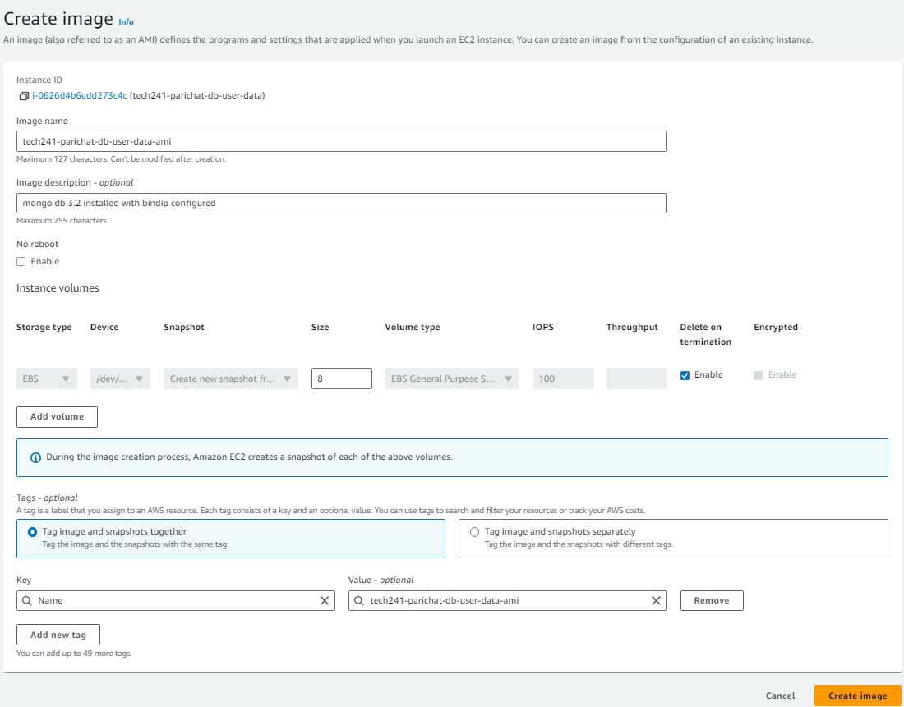
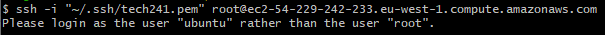

## What is DevOps?
DevOps is a methodology that is introduced to bridge the gap between developers and operations. This is to improve the software development life cycle. It promotes the automation of processes that allows the team to build, test and release software efficiently and effectively.

### Business values
ultimate goal is to get the working software released to the end users
* Release and deploy working software faster
* Able to keep up with competitors
* Continous improvement - able to recieve feedback and improve the software based on those feedback
* Quality and reliability - able to resolve issues and debug quickly, ensuring higher software quality
* Improve collaboration - enhances cross-functional team work
* Flexibility

### *Note*
*Make sure not to share or publish the aws credential or access keys, if discover that you intentially or unintentially leak those information, the company and you will get fined.*

For training, the region is in Ireland: eu-west-1 

## The difference between AWS and Azure

|  | Azure | AWS |
| ---------| ---------| -------|   
| Resource Groups | Necessary, everything goes into a resource group | Not necessary |
| Public IP address | Static | Dynamic |
| Terminology | create vm | launch instances |


### How to create ssh key on aws
1) Search: key pairs 
2) Create key pair
3) Select .pem file for use with OpenSSH
  
### Launch EC2 Intances or Create Virtual Machines
1) Give it a name: tech241-parichat-app-vm
2) Select image: browse more > community hub > ***ubuntun 18.04 lts 1e9***
3) Instance types: t2.micro (for training)
4) key pair: tech241 (shared key pair)
5) Network as default
6) Create security group and modify so that we can reuse it for every vm
   1) edit
   2) change name so you can remember and reuse it
   3) add port 3000 inbound rule
7) Configure storage as default

### Display of launching instance summary




### Terminate EC2 Instances
1) locate *instance state*
2) select *teminate instance*

### Create AMIs

#### Why do we need amis
* able to copy a vm quickly
* cost less in term of set up and running than a new vm as it only takes disk image

#### Set up user data vm
User data runs as a root user. It only runs once: as soon as it's created, it will run. Also, if you turn off the vm and start up again, the script will not run again.

1) create a *mongodb* vm
   1) select ubuntu image
   2) use the existing nsg 
   3) advanced details: 
      * paste the database vm script on user data (donot need sudo commands)
   
         

2) on user data vm instance overview: action > image and templates > create image
   1) image name: *tech241-parichat-db-ami*
   2) add new tag: *Name:tech241-parichat-db-ami* 

      

#### After create ami

3) launch instance with ami when ami status is ***available***
  
   when connect using ssh, ensure the path is *ubuntu* not *root*
   
   SSH in as root
   ```
   ssh -i "~/.ssh/tech241.pem" root@ec2-54-229-242-233.eu-west-1.compute.amazonaws.com
   ```
   

   SSH in as user
   ```
   ssh -i "~/.ssh/tech241.pem" ubuntu@ec2-54-229-242-233.eu-west-1.compute.amazonaws.com
   ```


### IP address
**Public IP address** - using public ip address, virtual machines that are in the same virtual network need to go through security group in order to communicate with a another virtual machine.

**Private IP address** - using private ip address allows the virtual machines to communicate directly through network interface controller without having go through network security group.

### *Notes*
#### Can we put the database vm ip adress into the URL?
This would not work as when we set up the db vm, we we don't allow http or https to access our vm. However, even if we allow https and http, we still wouldn't able to get anything as we don't have nginx installed on the db vm.

#### App vm ip address as env var 
The env variable that we specify is DB_HOST, which is specifying the endpoint of where the app vm to get database from. Therefore, this would not work because the endpoint would be the app itself and there is no MongoDB running.