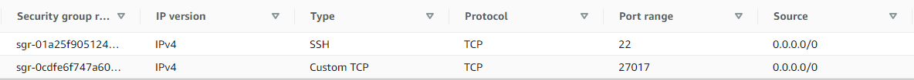
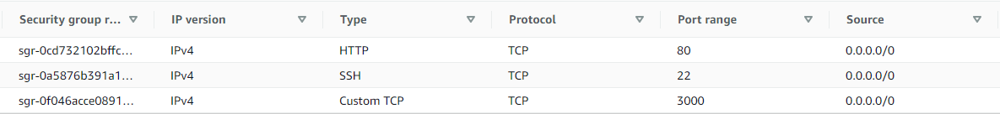

# Sparta App on AWS
Using the same scripts as Azure

## Database virtual machine
1) Launch new instance: database vm
   * select *ubuntu lts 18.04 with **ami-0a7493ba2bc35c1e9***
   * create a new security group
      1) add SSH inbound rule
      2) add port *27017* inbound rule
         
         

2) Run db script
3) Check status of MongoDB and bindIP

## App virtual machine
1) Launch new instance: database vm
   * select *ubuntu lts 18.04 with **ami-0a7493ba2bc35c1e9***
   * create a new security group
      1) add SSH inbound rule
      2) add port *3000* inbound rule
   
         

2) Modify the script: *change DB_HOST to new db vm ip address*
3) Set up reverse proxy
4) Run app script

## Troubleshooting
Couldn't get the posts page to work: *cannot GET posts*. I had to restart the vms in order to for the posts page to work.

1) On db virtual machine terminal:
   1) check the status of MongoDB
   2) check bindIP, if it is changed to 0.0.0.0
2) On app virtual machine terminal:
   1) check ip address of env variable
   2) check if reverse proxy working
3) Check inbound rules on aws security groups
4) Restart vms

