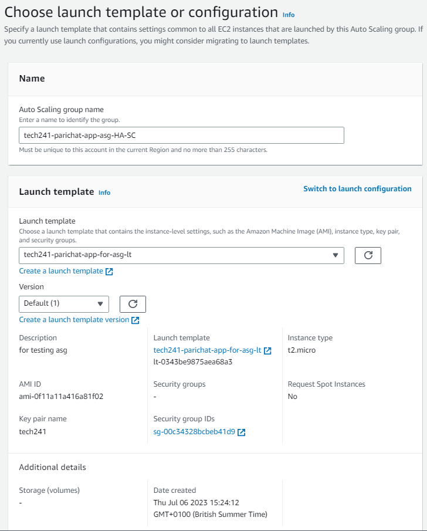
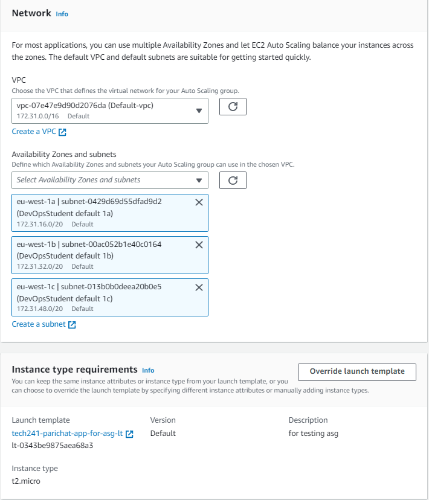
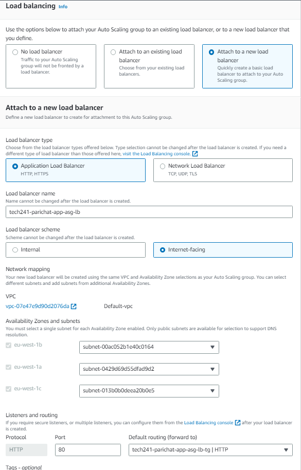
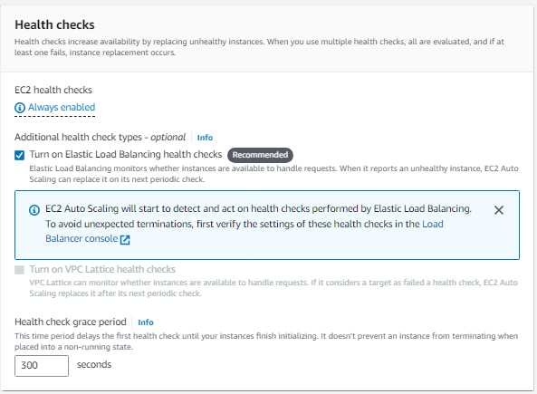
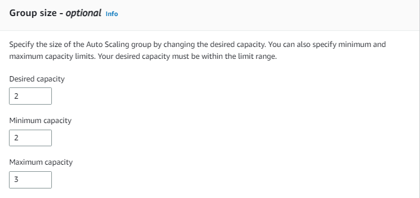
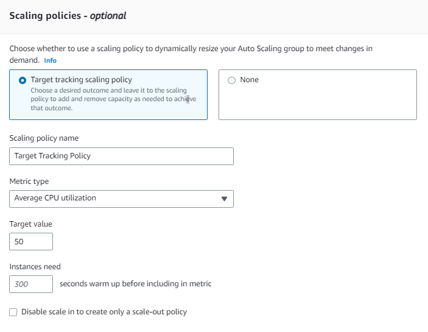
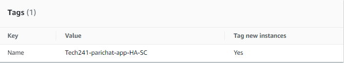

# AWS Auto Scaling Group

### Why do we need auto scaling group?
* Scalability - can scale up or down
* High avaliability - each vms are in different zones in the same region. If there are more vms than the availability zones, it is going to spread the vms among the zones.

### Create auto scaling

1) Choose the launch template

   

2) Choose availability zones

   

3) Select *attach to a new load balancer*
   1) select *application load balancer*
   2) load balancer scheme: *internet-facing*
   3) Listener and routing: select *an existing target group or create a new one*
   
   

5) Select *Turn on Elastic Load balancer health checks*
   
   

6) Group size - determine numbers of instances; it will not not go below the mininum and over the maximum 
   1) Desired capacity: 2
   2) Mininum capacity: 2
   3) Maximum capacity: 3
   
   
   
7) scaling policies: select *target tracking scaling policy*
   
   
   
8) Add tags
   
   Key: *Name*
   
   Value: *Tech241-parichat-app-HA-SC*
   
   

### Load balancer

We access the app web page through load balancer using dns name on load balancer page. If a vm is terminated, the load balancer takes times catch up and it will only send the traffic to the working vm(s).