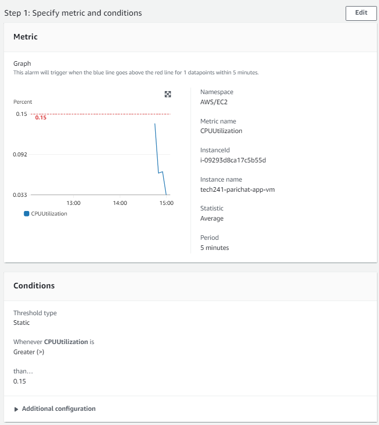
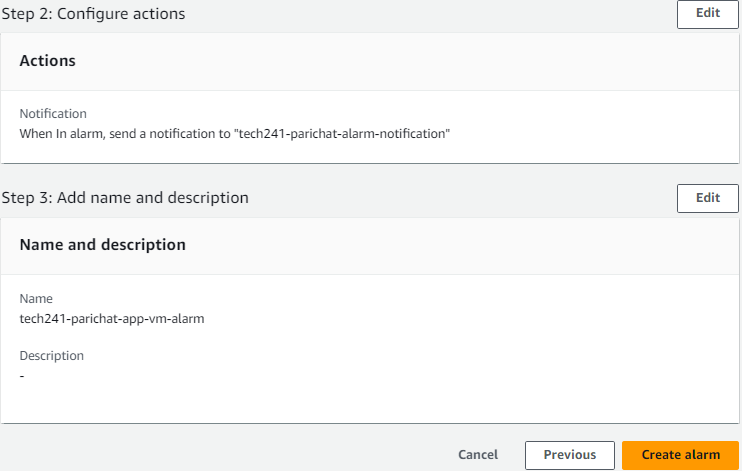
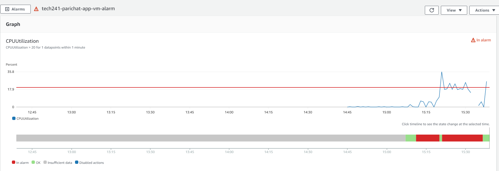

# Cloudwatch monitoring and alert management

### Create an alarm
1) Cloudwatch
2) All alarms > create alarm
3) select metric: using instance id to search
   
   1) select: CPUUtilization  
   
        
   
   2) Period: select time period
   
   3) Enter the threshold value

4) Configure actions
   Notification - you can add alarm state trigger when *in alarm* state to send you a notification to your email.

### Review and create alarm

You can add the alarm to a or existing new dashboard

Your alarm overview > action > add to dashboard 

### Notes
https://docs.aws.amazon.com/AmazonCloudWatch/latest/monitoring/US_AlarmAtThresholdEC2.html 