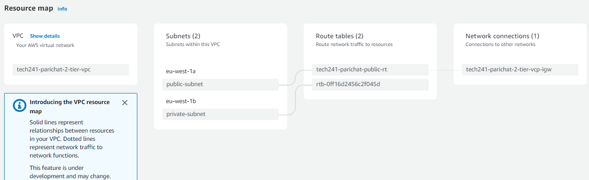

# VPC

## 1) Set up vpc
1) Search vpc
2) Create vpc
3) VPC only
4) Name: tech241-parichat-2-tier
5) IPv4 CIDR: 10.0.0.0/16

## 2) Set up internet gateway
1) Create internet gateway
2) Name tag: tech241-parichat-2-tier-vcp-igw

## 3) Attach to vpc
Action: attach to vpc
   1) search vpc
   2) attach to vpc

## 4) Create subnets
1) Create subnets
2) search vpc 
3) Subnet settings:
   1) Subnet 1 
      1) Name: public
      2) az: eu west 1a
      3) CIDR: 10.0.2.0/24
   2) Subnet 2
      1) Name: private subnet
      2) az: eu-west-1b
      3) CIDR: 10.0.3.0/24

## 5) Set up public route table
We dont need to create default route table
1) create route table
2) Name: tech241-parichat-public-rt
3) VPC:

## 6) Add routes
On public route table
1) link to pub subnet
   1) subnet associations
   2) edit subnet associations
   3) select public subnet
2) Routes
   1) add route 
   2) Destination: 0.0.0.0
   3) Target: your internet gateway

## 7) add vms
1) put app vm into the pub setnet
2) launch instances
   1) tech241-parichat-app-only-vpc
   2) my ami: set up to use with asg: app-for-asg-ami
   3) tech241
   4) Network setting
      1) edit
      2) change vpc to the set up
      3) select subnet: public
      4) enable public ip 
      5) create new sg
      6) tech241-parichat-app-only-vpc-sg-ssh-http-3000
      7) add http: source anywhere 
      8) add 3000: anywhere
   5) Userdata: script for running app only
   6) Launch instance

