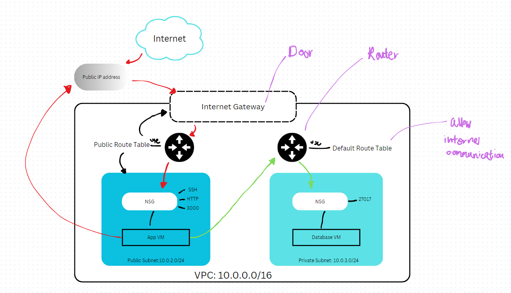

# Virtual Private Cloud (VPC)

## What is a VPC?
A virtual Private Cloud is a logically isolated virtual network within a public cloud infrastructure. It allows users to provision a private section of the cloud where they can launch resources.

## Why VPCs?
For secure and isolated environments within the public cloud. It increases security, flexibility and scalability.

## The benefits
* Security
* Flexibility
* Scalability
* Cost optimisation
  
## Benefits for business
* Enhanced security
* Cost optimisation - they can optimise their cloud costs
* Regulatory Compliance - help business neet compliance requirements by providing isolation and control over their network infrastructure

## Benefits for DevOps
1) Infrastructure of Code - this allows for automated and repeatable provisioning of VPC resources, ensuring consistency across environments
2) Secure communication - VPCs allow secure communication between different components of an application. 
3) Network isolation - it provides a dedicated and isolated environment 

## AWS and VPCs
This is because the need for secure and isolated network environments within its cloud infrastructure.

By introducing VPCs, AWS ensures that the customers could deploy resources in a private and controlled network environment.

## Subnet
Subnets are subdivisions of virtual network where vnet is like a house and subnets act like rooms. In VPCs, subnets are used to partition IP address ranges and provide isolation between different resources.

## Public and Private Subnets
* Public subnets are conneted to the internet via an internet gateway. Resources within the subnets have public ip addresses associated with them, allowing them to send and receive traffic directly from the internet.
* Private subnets are not directly accessible from the internet: no public ip addresses associated with their resources. To access the internet or other external resources, resources in the private subnets must go through NAT gateway or NAT instance.

## CIDR Blocks
CIDR (Classless Inter-Domain Routing) blocks are used to define ip address ranges within a network. In VPCs, CIDR are assigned to subnets to determine the range of ip addresses available within each subnet.

When designing VPC, ensure that CIDR blocks not overlap with other networks and allow for future growth and flexibility.

## Internet Gateway
Internet gateway acts like a door or entry point for internet traffic coming into ot going out of the VPC.

## Route Tables
Route tables control traffic flow between subnets within a VPC. Each subnets is associated with a route table that contains routes defining where the network trffic should be directed.

## Security Groups at the Instance level
Security groups allow to specify rules that allow or deny traffic based on protocols, ports and ip addresses. Each security group contains inbound and outbound rules that define the traffic flow. The security groups act like firewalls controlling traffic. 

## VPC of 2-tier architecture of Sparta App diagram

